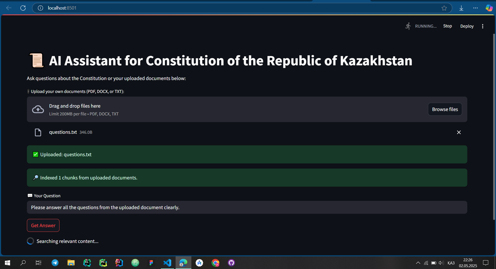
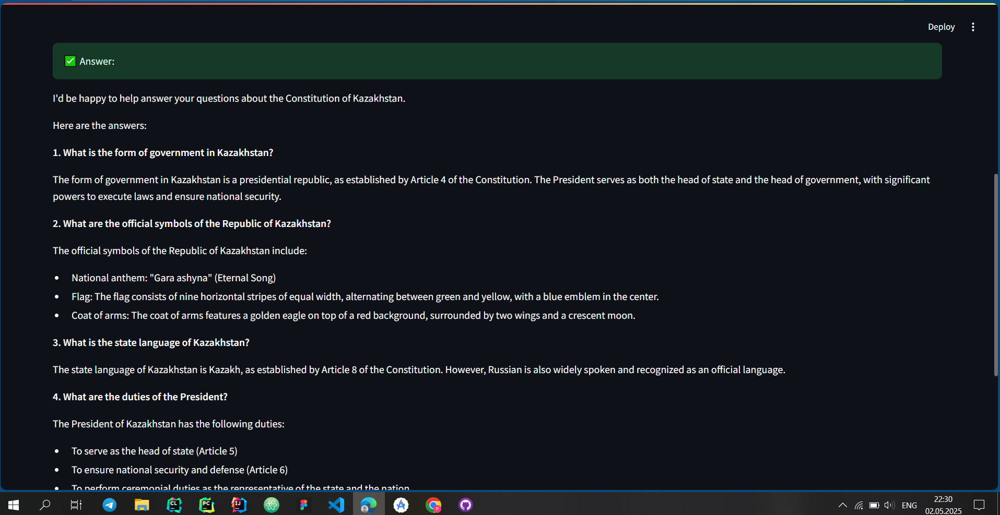
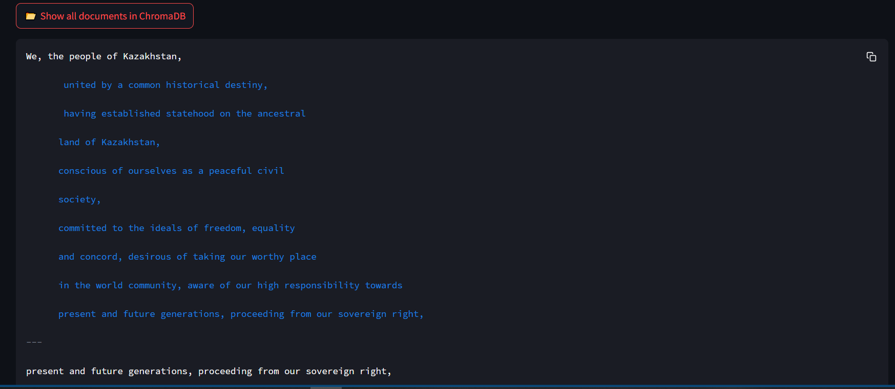

# 🇰🇿 AI Assistant for Constitution of the Republic of Kazakhstan

An intelligent assistant that can answer questions related to the Constitution of the Republic of Kazakhstan and any uploaded legal documents.

Built using **Streamlit**, **Ollama + Llama3.2**, **LangChain**, and **ChromaDB**.

---

## 📸 Demo Screenshots

### 🧠 Main Interface


### 📎 Uploading Document and Indexing


### 📂 Showing Stored Documents in ChromaDB


---

## 🚀 Features

- ✅ Chat interface using **Streamlit**
- ✅ Uses **Llama 3.2** (via Ollama) as the LLM
- ✅ Stores documents in **ChromaDB** as vector store
- ✅ Supports file upload: `.txt`, `.pdf`, `.docx`
- ✅ Allows **multiple files at once**
- ✅ Automatically indexes uploaded documents
- ✅ Answers user questions using **RAG (Retrieval-Augmented Generation)**
- ✅ Saves chat history (Q&A) to `query_log.json`
- ✅ Button to preview all indexed documents from ChromaDB

---

## 🛠️ Installation

1. Clone this repo or download the ZIP:
```bash
git clone https://github.com/asylbekuly/kazakhstan-constitution-ai.git
cd kazakhstan-constitution-ai
